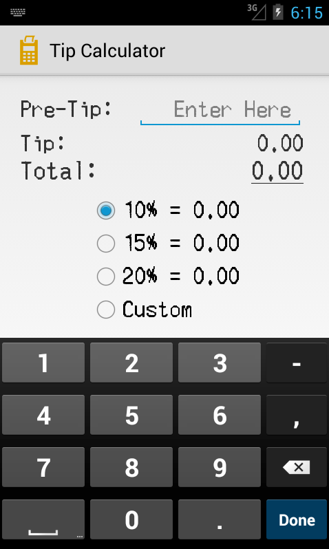
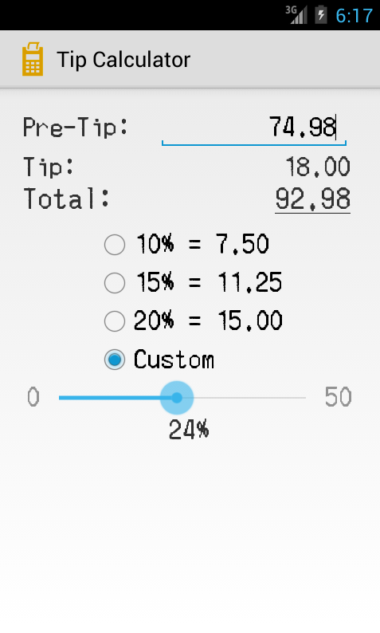
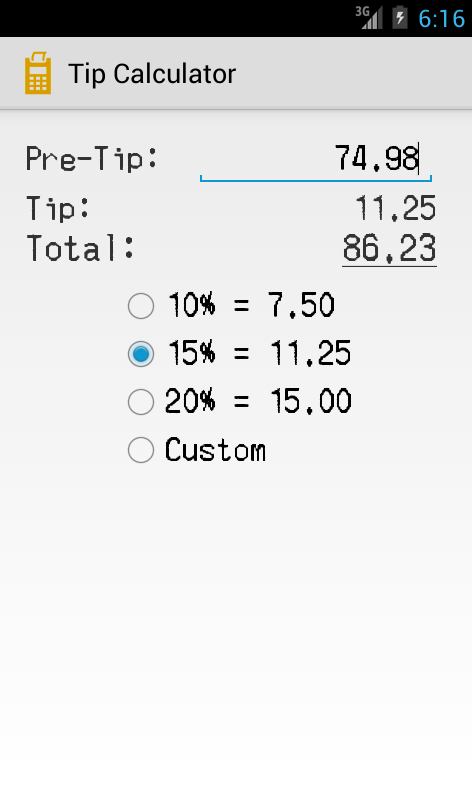

cpath-tip-calculator
====================

TheCodePath: Tip Calculator

Preview:

Completed Stories:
* User is displayed the tip of specified percentage for specified entered amount
* User enters the total amount of the transaction
* User can select between tip amounts (i.e 10%, 15%, 20%)
* Upon selecting tip amount, formatted tip value is displayed
* (Optional) User changes the total amount and updated tip is reflected automatically
* (Optional) User can select custom tip amount if desired -- custom up to 50%
* (Optional) Experiment with trying input widgets to replace the buttons and/or textviews
